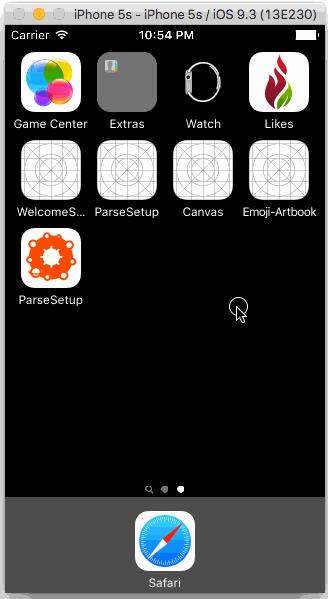

# Project 6 - Emoji Artbook

**Emoji Artbook** is an iOS app with a tray of smiley faces that can be dragged onto a canvas with a background image. 

Time spent: **7** hours spent in total

## User Stories

The following features are implemented:
  
- [x] Create new canvas
- [x] Save canvas
- [x] Change background image

## Video Walkthrough 

GIF created with [LiceCap](http://www.cockos.com/licecap/).

## Notes

Open to ideas and looking to add team members to work on the project. 

## License

Copyright [2016] [Monte Thakkar]

Licensed under the Apache License, Version 2.0 (the "License");
you may not use this file except in compliance with the License.
You may obtain a copy of the License at

http://www.apache.org/licenses/LICENSE-2.0

Unless required by applicable law or agreed to in writing, software
distributed under the License is distributed on an "AS IS" BASIS,
WITHOUT WARRANTIES OR CONDITIONS OF ANY KIND, either express or implied.
See the License for the specific language governing permissions and
limitations under the License.

